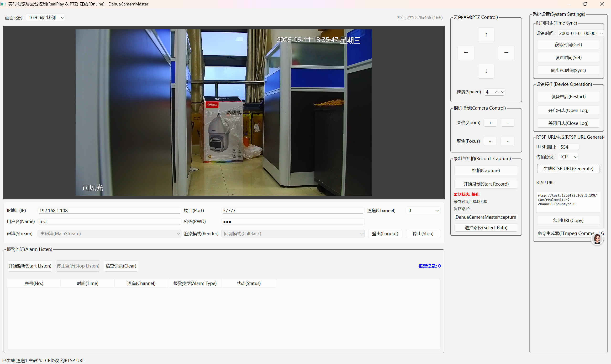

# DahuaCameraMaster - 大华摄像机大师

**一句话：**
大华Demo有的我有，大华Demo没有的我也有！

解决了大华Demo不好用的问题~

## 项目简介

DahuaCameraMaster 是一个基于Python和PySide6开发的大华摄像机管理工具，支持多摄像机管理、设备搜索、配置保存、抓拍、视频录制、设备控制和报警监听等全面功能。

## 注意

自带视频录制不能用，回头多看看文档再说吧~
优先使用FFMpeg

## 界面截图




## 主要功能

### 1. 设备搜索

* **组播和广播搜索**：自动发现网络中的大华设备
* **单播搜索**：根据IP范围搜索指定设备
* **设备状态显示**：显示设备初始化状态、IP地址、MAC地址等信息

### 2. 设备管理

* **设备初始化**：支持未初始化设备的账号设置
* **多摄像机连接**：可同时连接多个摄像机设备
* **配置持久化**：自动保存设备登录信息

### 3. 摄像机控制

* **实时预览**：支持主码流和辅码流预览
* **PTZ控制**：云台方向控制、变倍、聚焦调节
* **多窗口支持**：每个摄像机独立窗口操作

### 4. 抓拍功能 📸

* **一键抓拍**：实时抓取当前画面并保存为JPEG图片
* **自动命名**：根据IP地址、通道号和时间戳自动生成文件名
* **回调处理**：使用SDK回调机制确保抓拍成功

### 5. 视频录制功能 🎥

* **实时录制**：录制当前预览的视频流
* **录制状态显示**：实时显示录制状态和录制时间
* **自动保存**：录制文件自动保存为DAV格式
* **录制计时**：显示录制时长，支持手动停止

### 6. 设备控制功能 ⚙️

* **时间同步**：获取设备时间、设置设备时间、同步PC时间到设备
* **设备重启**：远程重启设备功能
* **日志管理**：开启/关闭SDK日志记录
* **实时校时**：支持Windows系统时间同步到设备

### 7. 报警监听功能 🆕 🚨

* **实时监听**：实时监听设备报警事件
* **动检报警**：支持动态检测报警监听
* **报警记录**：表格形式显示报警历史记录
* **状态显示**：显示报警类型、通道、时间和状态
* **记录管理**：支持清空记录，自动限制记录数量

### 8. 文件管理

* **保存路径选择**：可自定义抓拍和录制文件的保存路径
* **文件自动命名**：按照规范格式自动生成文件名
* **目录自动创建**：保存目录不存在时自动创建

## 文件结构

```shell
DahuaCameraMaster/
├── main.py                          # 外部启动入口文件
├── run.bat                         # Windows启动脚本
├── capture/                        # 默认保存目录（自动创建）
├── output/                         # 输出目录
├── src/                           # 源代码目录
│   ├── main.py                   # 内部主入口文件
│   ├── config_manager.py         # 配置管理类
│   ├── device_search_window.py   # 设备搜索主窗口
│   ├── device_search_ui.py       # 设备搜索界面
│   ├── init_device_dialog_ui.py  # 设备初始化对话框
│   ├── DahuaCamMain.py          # 摄像机控制窗口（完整功能）
│   └── DahuaCamUI.py            # 摄像机控制界面（增强版）
├── camera_configs.json           # 配置文件（自动生成）
├── sdk_log.log                   # SDK日志文件（可选）
└── README.md                    # 完整文档
```

## 使用方法

### 1. 启动应用程序

```bash
# 从项目根目录启动
python main.py

# 或者直接运行内部main
python src/main.py

# 或者使用批处理文件（Windows）
run.bat
```

### 2. 搜索设备

* 点击"组播和广播搜索"按钮自动发现网络中的设备
* 或者在"单播搜索"区域输入IP范围进行精确搜索

### 3. 初始化设备

* 选择未初始化的设备
* 点击"初始化设备"按钮
* 填写用户名、密码等信息完成初始化

### 4. 连接摄像机

* 选择已初始化的设备
* 点击"连接摄像机"按钮或表格中的"连接"按钮
* 系统会打开新的摄像机控制窗口

### 5. 摄像机操作

* 在摄像机控制窗口中填写登录信息（如有保存的配置会自动填充）
* 点击"登录"按钮连接设备
* 点击"预览"按钮开始视频预览
* 使用PTZ控制面板进行云台操作

### 6. 抓拍功能

* 确保设备已登录并开始预览
* 点击"抓拍(Capture)"按钮
* 系统将自动保存当前画面为JPEG图片
* 抓拍成功后会显示保存路径

### 7. 视频录制功能

* 确保设备已登录并开始预览
* 点击"开始录制(Start Record)"按钮开始录制
* 系统会显示录制状态和录制时间
* 点击"停止录制(Stop Record)"按钮结束录制
* 录制文件自动保存为DAV格式

### 8. 设备控制功能

#### 时间同步

* **获取时间**：点击"获取时间(Get)"按钮获取设备当前时间
* **设置时间**：修改时间后点击"设置时间(Set)"按钮设置设备时间
* **同步PC时间**：点击"同步PC时间(Sync)"按钮将Windows系统时间同步到设备

#### 设备管理

* **远程重启**：点击"设备重启(Restart)"按钮远程重启设备
* **日志管理**：使用"开启日志"和"关闭日志"按钮控制SDK日志记录

### 9. 报警监听功能 🆕

* **开始监听**：设备登录后，点击"开始监听(Start Listen)"按钮开启报警监听
* **实时显示**：系统将在底部报警列表中实时显示报警信息
* **报警类型**：当前支持动态检测报警监听
* **记录管理**：
  + 点击"停止监听(Stop Listen)"停止报警监听
  + 点击"清空记录(Clear)"清空报警历史记录
  + 系统自动限制记录数量（最大500条）
* **信息详情**：每条报警记录包含序号、时间、通道、报警类型和状态

### 10. 保存路径管理

* 默认保存路径为 `./capture`
* 点击"选择路径(Select Path)"按钮可自定义保存位置
* 系统会自动创建不存在的目录

## 文件命名规则

### 抓拍文件

```shell
capture_{IP地址}_{通道号}_{时间戳}.jpg
# 例如: capture_192_168_1_108_ch0_20231211_143025.jpg
```

### 录制文件

```shell
record_{IP地址}_{通道号}_{时间戳}.dav
# 例如: record_192_168_1_108_ch0_20231211_143025.dav
```

### 日志文件

```shell
sdk_log.log # SDK运行日志文件
```

## 界面布局

### 主要区域分布

* **上方**：视频预览区域和登录控制
* **右侧**：PTZ控制、抓拍录制、设备控制功能
* **下方**：报警监听区域（避免右侧拥挤） 🆕

### 报警监听界面

* **控制按钮**：开始监听、停止监听、清空记录
* **统计信息**：显示当前报警记录数量
* **报警列表**：表格形式显示详细报警信息

## 配置管理

应用程序会自动保存设备的登录配置到 `camera_configs.json` 文件中

包括：

* IP地址
* 端口号
* 用户名
* 密码
* 最后登录状态

下次连接相同设备时会自动加载保存的配置。

## 系统要求

* Python 3.7+
* PySide6
* 大华NetSDK Python版本
* Windows 7/10/11（推荐）

## 依赖安装

```bash
pip install PySide6
```

## 注意事项

01. 确保NetSDK库文件在正确的路径下
02. 运行程序需要管理员权限（用于网络搜索功能）
03. 防火墙可能会阻止设备搜索，请适当配置
04. 支持同时连接多个摄像机，每个摄像机独立窗口操作
05. 抓拍和录制功能需要设备已登录并开始预览
06. 录制文件为DAV格式，可用支持该格式的播放器播放
07. 长时间录制请确保磁盘空间充足
08. 设备重启后需要重新连接
09. 时间同步功能确保设备时间准确性
10. 报警监听功能需要设备支持报警上报 🆕
11. 报警记录过多时系统会自动清空以保证性能 🆕

## 架构说明

### 双入口设计

* **外部main.py**: 项目根目录的启动入口，负责启动内部主程序
* **内部src/main.py**: 实际的应用程序入口，包含主要逻辑

### 模块化设计

* **设备搜索模块**: 负责网络设备发现和管理
* **配置管理模块**: 处理设备配置的保存和加载
* **摄像机控制模块**: 处理单个摄像机的连接和控制
* **抓拍录制模块**: 处理图片抓拍和视频录制功能
* **设备控制模块**: 处理设备时间同步、重启、日志管理等
* **报警监听模块**: 处理设备报警事件的实时监听 🆕
* **UI模块**: 各种用户界面组件

### 回调机制

* **抓拍回调**: 使用SDK回调处理抓拍结果
* **连接回调**: 处理设备连接状态变化
* **报警回调**: 实时处理设备报警事件 🆕
* **定时器机制**: 实时更新录制时间显示

## 功能特色

### 报警监听功能 🆕

* **实时响应**: 毫秒级报警事件响应
* **多类型支持**: 当前支持动态检测报警，可扩展其他报警类型
* **友好显示**: 表格形式清晰显示报警详情
* **性能优化**: 自动控制记录数量，避免内存溢出
* **状态跟踪**: 实时显示监听状态和报警计数

### 时间同步功能

* **实时获取**: 获取设备当前时间并显示
* **精确设置**: 可手动设置设备时间
* **一键同步**: 将Windows系统时间同步到设备
* **格式化显示**: 友好的时间格式显示

### 设备管理功能

* **远程重启**: 安全的设备重启机制
* **确认对话框**: 重要操作前的用户确认
* **状态监控**: 实时显示设备连接状态

### 日志管理功能

* **SDK日志**: 详细的SDK运行日志
* **文件保存**: 日志自动保存到文件
* **开关控制**: 可随时开启或关闭日志记录

## 更新日志

### v1.3.0 🆕

* 新增报警监听功能模块
* 新增动态检测报警实时监听
* 新增报警记录表格显示
* 新增报警统计和记录管理
* 优化界面布局，报警功能放置在底部区域
* 改进回调机制，支持多种事件类型
* 增强系统稳定性和用户体验

### v1.2.0

* 新增设备控制功能模块
* 新增时间同步功能（获取、设置、同步PC时间）
* 新增设备远程重启功能
* 新增SDK日志管理功能
* 优化UI布局，增加设备控制区域
* 改进错误处理和用户提示
* 增强功能完整性和实用性

### v1.1.0

* 新增抓拍功能，支持一键抓取当前画面
* 新增视频录制功能，支持实时录制视频流
* 新增保存路径选择功能
* 新增录制状态和时间显示
* 优化文件命名规则
* 改进UI布局，增加抓拍和录制控制区域

### v1.0.0

* 支持设备搜索功能（组播、广播、单播）
* 支持设备初始化
* 支持多摄像机管理
* 支持配置持久化
* 支持PTZ控制
* 双入口文件架构设计

## 技术支持

如有问题请联系技术支持或查看大华官方文档。

## 功能演示

01. **设备搜索**: 自动发现网络中的大华设备
02. **多窗口管理**: 每个摄像机独立控制窗口
03. **实时预览**: 高质量视频流预览
04. **云台控制**: 精确的PTZ控制
05. **一键抓拍**: 快速保存当前画面
06. **视频录制**: 长时间录制保存
07. **时间同步**: Windows时间同步到设备
08. **设备管理**: 远程重启和日志管理
09. **报警监听**: 实时监听设备报警事件 🆕
10. **配置管理**: 智能保存登录信息

## 完整功能列表

### 基础功能

* ✅ 设备搜索（组播、广播、单播）
* ✅ 设备初始化
* ✅ 多摄像机管理
* ✅ 配置持久化

### 预览控制

* ✅ 实时预览（主码流/辅码流）
* ✅ PTZ控制（方向、变倍、聚焦）
* ✅ 多窗口支持

### 媒体功能

* ✅ 图片抓拍
* ✅ 视频录制
* ✅ 文件管理

### 设备控制

* ✅ 获取设备时间
* ✅ 设置设备时间
* ✅ 同步PC时间
* ✅ 设备远程重启
* ✅ SDK日志管理

### 安全监控 🆕

* ✅ 动态检测报警监听
* ✅ 实时报警显示
* ✅ 报警记录管理
* ✅ 报警统计功能

DahuaCameraMaster 现在是一个功能完整的大华摄像机管理系统，涵盖了从设备发现到安全监控的全方位功能！
